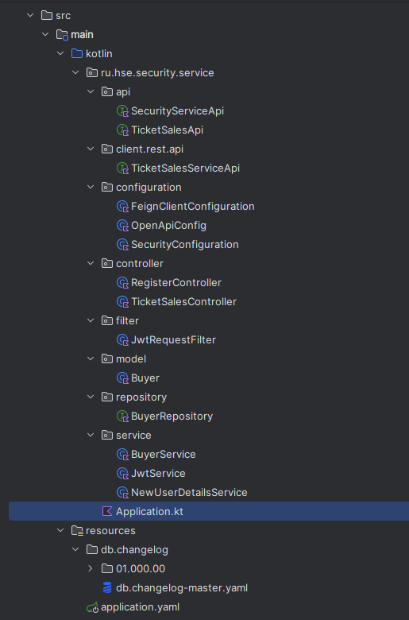
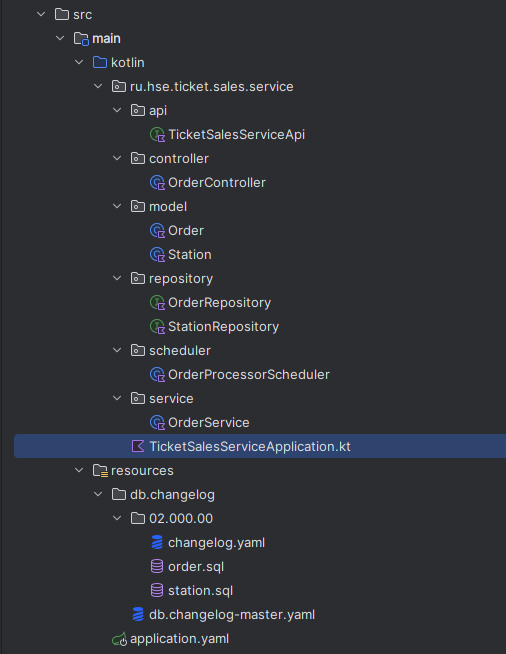

# Домашнее задание №3

## Евсюков Александр </br> Группа БПИ224

### Набор требований к проекту:

* `Java` версии 21
* `Gradle` версии 8.2
* `Spring Boot` версии 3.2.2

### Инструкция по запуску:

1. Склонируйте репозиторий с помощью команды `git clone`
2. Откройте проект в `IntelliJ IDEA`
3. Перейдите в директорию `dev-env` и запустите Docker с помощью команды `docker-compose up --build `
4. Запустите каждый микросервис с помощью комбинации клавиш `Ctrl + F10` или нажав на кнопку `Run` в правом верхнем углу
   (пытался запустить через терминал, но там что-то непонятное происходит)

### Инструкция по использованию:
Основным сервисом является `SecurityService`, который позволяет пользователю войти в систему и получить токен для работы с заказами. Также позволяет
управлять заказами за счет связи двух микросервисов через `OpenFeign`.
```
http://localhost:8080/swagger-ui/index.html
```

Сервис `TicketSalesService` предоставляет методы для работы с заказами.
```
http://localhost:8090/swagger-ui/index.html
```

### Структура проектов:
 

